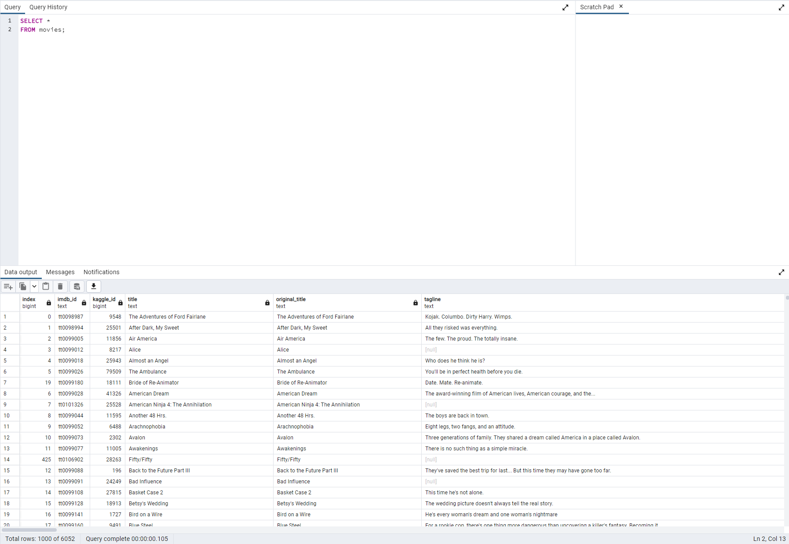
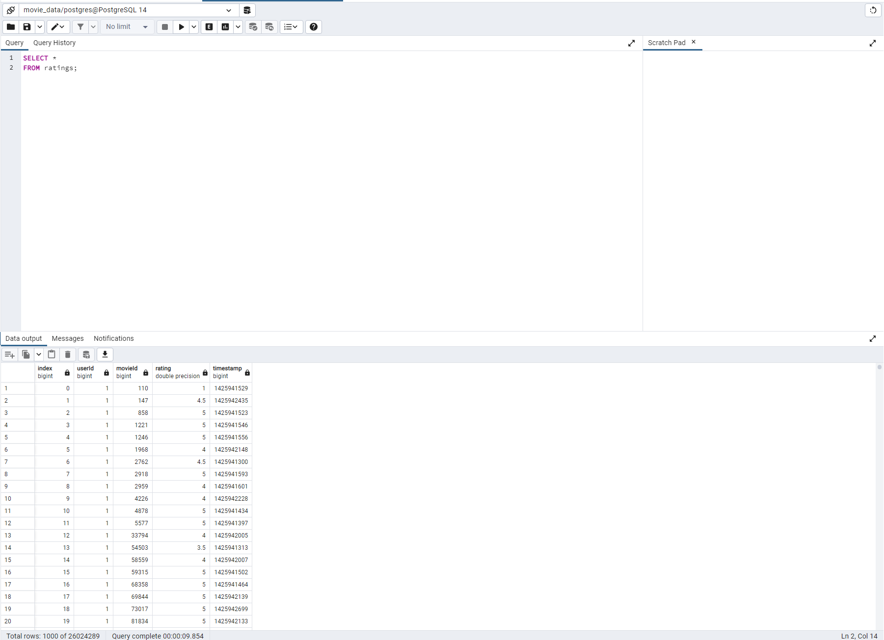

# Movies-ETL
## Project Overview
The purpose of this project was to create an ETL pipeline using movie data from three different sources(two csv and one json file). I created a function using Python to take in Wikipedia, Kaggle, and MovieLens data, then clean it up, merge them, and upload into a PostgreSQL database.

### Movies SQL Table

### Ratings SQL Table

